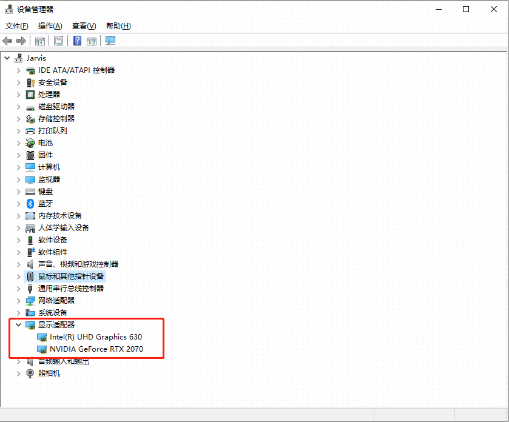
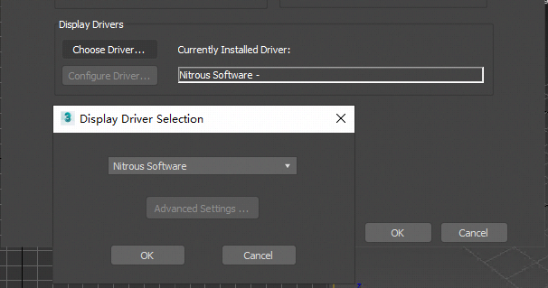
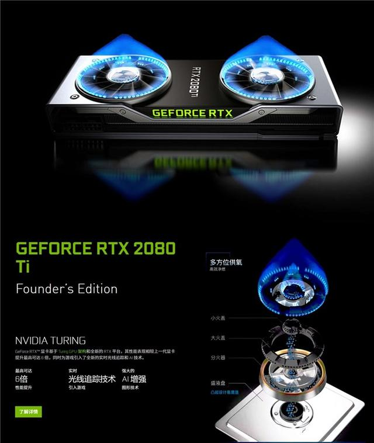

# Lesson1 三角和方块的故事

## 教程说明

欢迎来到 LearningWebGPU 教程，本教程改写自原本的 LearningWebGL.com 的 WebGL 入门教程，而后者则是改编于经典的 Nehe 的 OpenGL 教程。在开始教程前，有一些大家需要知道的事情：

1. 目前 WebGPU 仍然处于草稿阶段，所有的 API 接口可能会在未来发生变化。

2. 目前浏览器对于 WebGPU 的实现和支持仍处于实验阶段，可能会发生一些因为浏览器实现导致的 Bug 或错误；另外，开启浏览器的试验功能可能会降低浏览器的安全性，所以你不应该使用学习 WebGPU 开发的浏览器作为主力浏览器，例如请不要在这个浏览器中浏览、输入个人隐私信息、不要进行网页支付等。

3. 考虑到 WebGPU 正式投入生产环境应该是数年后的事情，所以本教程中将会使用大量新的 ECMA Script 的新特性，这些特性可能并不被当下的浏览器和 JavaScript 引擎所支持。

4. 本系列的教程是针对那些已经具备相应编程知识但没有实际 3D 图形经验的人的；目标是让学习者创建并运行代码，并且明白代码其中的含义，从而快速地创建自己的 3D Web 页面。

5. 我编写这套教程是因为我在独立学习 WebGPU，所以教程中可能（非常可能）会有错误，所以还请风险自担。尽管如此，我还是会不断的修正 Bug 和改正其中的错误的，所以如果你发现了教程中的错误或其他任何改进建议，请在本教程的 Github 仓库的 Issue 页面提交。

下面，让我们正式开始第 1 课的内容。

## 初始化 WebGPU

在上一节课中，我们成功获取了 WebGPU 的上下文。但是我们也提到过，尽管在 WebGL 中上下文是 JavaScript 和 GPU 交互的重要桥梁，几乎所有的 WebGL 接口都是通过上下文来实现的；但是在 WebGPU 标准中，由于摒弃了固定渲染管线，并且从理念和设计哲学上高度借鉴 DirectX 12、Vulkan、Metal 这三大现代图形标准，所以 WebGPU 的上下文将不再承担如此繁重的工作，而仅仅成为和 HTML `<canvas>` 元素交互的桥梁。所以，在这节课中我们将会迎来一些新朋友，它们和上下文一起，组成了 WebGPU 绘制的基础环境。

打开 `app.ts` 文件，我们发现代码比上节课多了很多。如果你之前没有接触过 WebGL 原生 API，会认为如此多的的代码只为了画一个三角形和一个正方形，是不是有点过于[复杂](https://www.weibo.com/1657422865/zz19IFEfc?type=comment#_rnd1577769550951)；相反，如果你接触过 WebGL 或者学习过本课程的 WebGL 版本，那么你应该早已习以为常。事实上，相比 WebGL 的一次完整绘制流程，WebGPU 在概念和代码的复杂度上，都要降低很多了。

首先，我们可以看到，我们从依赖中引入了一个新的模块，叫做 `glslangModule`。

```typescript
import glslangModule from '@webgpu/glslang/dist/web-devel/glslang.onefile';
```

如果你还记得上一课中，我们曾经提起过，现时的 WebGPU 实际上发生了分裂，一派以 Apple 为代表的使用基于文本的 WSL 语言作为着色器语言，另一派以 Google 为代表的使用 GLSL 4.5 并编译成二进制的 SPIR-V 作为着色器语言。本套教程正是基于后者的，所以这个 `glslangModule` 就是用来把 GLSL 4.5 编译成 SPIR-V 的，编译过程中使用了 WebAssembly。

然后，相比上一课我们的 `App` 类只有一个公共成员 `canvas`，而这一课我们突然拥有了包括 `adapter`、`device`、`swapChain` 在内的许多其他成员。我会在下文中详细解释每个成员的作用。

接下来，我们的 `CreateCanvas()` 函数没有发生任何变化，但是 `InitWebGPU()` 函数发生了剧烈变化。下面让我们慢慢来看这个函数。

首先，我们在声明函数时，为 `InitWebGPU()` 函数加入了 `async` 关键字，用于表示这是一个异步函数。

```typescript
    public async InitWebGPU() {
```

### GPUAdapter 适配器

然后，我们初始化了一个叫做 `GPUAdapter` 的东西。

```typescript
    public adapter: GPUAdapter;
```

```typescript
        this.adapter = await navigator.gpu.requestAdapter( {

            powerPreference: 'high-performance'

        } );
```

`GPUAdapter` 的中文名字叫做**适配器**，如果你使用的是 Windows 操作系统，你可以打开设备管理器，找到你的显卡硬件那一栏，你可以看到上面写的是并不是什么显卡之类的字样，而是**显示适配器**。



*图为 Windows 10 操作系统中设备管理器界面中的显示适配器。*

是的，这里的 `GPUAdapter` 就是显示适配器的意思，也就是我们通常所说的**显卡**。

> 一个***适配器***代表了操作系统中一个 WebGPU 的实现。每个适配器标志着一个硬件加速器（例如 GPU 或 CPU）实例和一个浏览器在该硬件加速器之上对 WebGPU 的实现。
> 
> —— 摘自 [WebGPU 标准](https://gpuweb.github.io/gpuweb/#adapters)

以上就是 WebGPU 标准原文中对适配器的定义。这里有个很奇怪的地方，我们一直在说 GPU 的事情，为什么突然冒出了个 CPU 呢？

原因是，事实上在 GPU 被发明出来之前，大部分的图形工作都是使用中央处理器，也就是由 CPU 来承担的，在现代图形应用中，我们依然可以找到很多的应用程序在使用 CPU 绘制图形，只不过我们现在给它取了一个更好听的名字，叫做“软件渲染器”或者“软件加速”。

举个例子来说，例如和我们平常在家使用的台式机不一样，在服务器环境中，通常是没有一台硬件显示器使用 HDMI 或者 DP 接口的线缆插入到显卡的对应插槽来输出用户界面的；大多数服务器用户或开发者是使用 SSH 等命令行方式，或者远程桌面的方式来操控服务器的。

在这种情况下，操作系统并不会初始化 DirectX、Vulkan、OpenGL 之类的图形 API。没有了这些接口，应用程序自然无法使用 GPU 硬件加速的图形绘制，于是在这种情况下，软件渲染器就派上了大用场。



*图为 Autodesk 3Ds Max 在没有硬件加速的情况下，使用 Nitrous Software Renderer 来渲染 3D 视口。*

所以在 WebGPU 的标准中，特别注明了下面这样一段话。

> 注意：一个适配器可以是物理显示适配器（GPU），但它也可以是一个软件渲染器。返回的适配器对象可以指向不同的物理适配器，或者指向在该物理适配器之上不同的浏览器代码路径或者不同的操作系统驱动。应用程序可以同时使用多个适配器（通过 `GPUAdapter` 接口）（即使有些适配器是不可用的），两个不同的适配器接口对象可以代表同一块物理适配器配置的不同实例（例如，如果在某个 GPU 被重置，或者断开连接又重新连接的情况下）。

回到代码，我们使用的是 `navigator.gpu.requestAdapter()` 接口来获取的适配器。根据 WebGPU 标准，浏览器会在页面主线程和 Web Worker 的`navigator` 这一全局对象下同时增加一个名为 `gpu` 的只读属性。

> *`gpu`* 对象定义了 `navigator.gpu` 接口，它是 WebGPU 的入口。该对象暴露了 `requestAdapter()` 方法，用于获取适配器。
> 
> —— 摘自 [WebGPU 标准](https://gpuweb.github.io/gpuweb/#gpu-interface)

这个方法是一个异步函数，如果成功将返回一个 resolve 的 `Promise<GPUAdapter>` 对象；如果获取失败，将会返回一个 reject 的 `Promise<DOMException("OperationError")>` 对象。

这个方法接受一个类型为 `GPURequestAdapterOptions` 的参数，用于告诉浏览器，我们要获取一个什么样的显示适配器。

这个选项在目前主要是为桌面平台的笔记本设备服务的。

在当前大部分的 X86 架构的桌面电脑上，实际上一般都会有两个 GPU。一个是由中央处理器 CPU 提供的 GPU 部分，例如 Intel 品牌大部分的 CPU 和 AMD APU 系列都会提供一个功能相对完备但性能较弱的 GPU 硬件处理单元；另一个则是通常安装在主板 PCI-Express 插槽上的独立显卡。

前者就是我们通常俗称的“核显”、“板载显卡”或“集成显卡”，后者我们则叫做“独显”。

你可以在上面那张 Windows 设备管理器的截图上看到，我的笔记本有两个显示适配器，一个是 Intel UHD Graphics 630，也就是核显；另一个是 NVIDIA Geforce RTX 2070，也就是独显。

在台式机上实际上也存在同样两个 GPU，但是一般我们会在装机时，通过在 BIOS 中的设定，设置为只使用独立显卡。

一般来说，独立显卡可以提供更高的性能，但是同时会带来更高的耗电，并导致散热系统硬件的负担加重，在使用风冷的电脑上，会让风扇转速增加，带来额外的噪音，并导致设备续航时间下降；与之相对的是，集成显卡虽然性能较弱，但是在耗电上却极具优势，可以延长设备的续航时间。

在 Windows 操作系统的笔记本电脑上，你可以通过显卡的控制面板，来选择默认使用哪个 GPU 和为某个应用程序指定其使用的 GPU。一般来说，操作系统会自动判断应用程序的类型，为桌面绘制和一般应用程序（例如文字处理程序、聊天软件等）启用集成显卡，为游戏启用独立显卡。


*图为 NVIDIA 控制面板中选择默认 GPU 的界面*

回到 WebGPU 的话题，同样我们在请求适配器的时候，也可以根据当前应用的具体情况，通过 `GPURequestAdapterOptions` 参数，请求不同的显示适配器。

目前 `GPURequestAdapterOptions` 参数只有一个可选字段，就是 `powerPreference`，这个字段顾名思义就是耗电选项，它的可选值是一个名为 `GPUPowerPreference` 的枚举值。

```c
enum GPUPowerPreference {
    "low-power",
    "high-performance"
};
```

这个枚举类型有两个值：一个是 `"low-power"` 代表低耗电；另一个是 `"high-performance"` 代表高性能。

在 WebGPU 标准中，特别注明了应该在什么情况下使用不同的适配器。

> 注意：通常来说，如果内容不受绘制性能禁锢，应当使用低耗电的显示适配器；例如，如果每秒只渲染一帧，或者只使用简单的着色器绘制简单的几何体，或者 HTML `canvas` 元素的尺寸非常小。我们鼓励开发者在内容允许的情况下使用低耗电的显示适配器，因为它可以显著的改善移动设备的续航能力。
>
> 注意：如果选择了高性能的显示适配器，开发者应当注意，系统有可能基于省电的原因，迫使由此适配器创建的设备强制丢失。只有在开发者相信是绝对需要的情况下，才应当选择高性能的显示适配器，因为它会显著的降低移动设备的续航时间。
>
> —— 摘自 [WebGPU 标准](https://gpuweb.github.io/gpuweb/#adapter-creation)

所以，当我们未来在生产环境中，可以自由的根据应用的不同情况，来选择不同的显示适配器，这也是在 WebGL 中做不到的。

根据我的 WebGL 开发经验，Intel 系列核显的驱动经常会出问题，所以通常我会在显卡控制面板中设置优先使用高性能显卡，也就养成了这个习惯，所以在本套教程中，我尽管**不应该**，但还是选择使用了高性能的显示适配器。

好了，关于显示适配器的话题就到这里告一段落了。

不对，等等！如果一台电脑有三个显卡呢？我指的不是使用两块 NVIDIA 显卡做 [NVLink](https://zh.wikipedia.org/wiki/NVLink) 或者 [SLI](https://zh.wikipedia.org/wiki/NVIDIA_SLI)，也不是 AMD 显卡的[交火（CrossFire）技术](https://zh.wikipedia.org/wiki/AMD_CrossFire)，而是我给我的笔记本插入了一个外置显卡钨，里面安装了一个 NVIDIA Geforce RTX 2080Ti 显卡，这时候我的电脑有了三个显卡，一个核显，两个独显，甚至外接的独显比我笔记本电脑本身的独显还要好。

这时候两个独显的配置同为 `"high-performance"`，当我请求使用高性能显示适配器的时候，WebGPU 实现将会为我返回哪个显卡呢？

### glslang

接下来，我们直接执行了从 `@webgpu/glslang` 模块引入的 `glslangModule()` 函数，这也是一个异步函数。

```typescript
        this.glslang = await glslangModule();
```

其主要作用是初始化 glslang 模块，方便后续对 GLSL 语言源代码的编译。

你如果感兴趣其中的运作机制，可以直接参考 glslang 的[源代码](https://github.com/kainino0x/-webgpu-glslang)。

### GPUDevice 设备

下面，我们利用刚刚获得的适配器对象，来获取了一个称为 `GPUDevice` 的对象。

```typescript
    public device: GPUDevice;
```

```typescript
        this.device = await this.adapter.requestDevice();
```

> ***设备***是一个适配器逻辑上实例化的过程，通过它创建了内部对象（internal objects）。它可以在多个 agent 中共享（例如[专用 Worker](https://developer.mozilla.org/zh-CN/docs/Web/API/Web_Workers_API/Using_web_workers)）。
> 
> —— 摘自 [WebGPU 标准](https://gpuweb.github.io/gpuweb/#devices)

你可以把 GPU 设备想象成适配器提供的具体的硬件实例，例如显存，利用设备你可以在显存中创建缓存（Buffer）、纹理（Texture）、渲染管线（Pipeline）、着色器模块（Shader Module）等，对显示适配器中的设备进行具体操作。

或者用一个不太恰当的比喻，GPU 适配器好比是你得到的一块显卡，它很大，像一个燃气灶，上面有好多东西，但很多东西是你不需要的，比如上面的风扇、炫酷的 LED 灯、各种线缆插槽、还有那块挡板铁片、那些螺丝，这些东西对你做 GPU 绘制是没有用的。什么是有用的呢？比如显存！比如 GPU 芯片！比如顶点处理单元！而 GPUDevice 就好比是适配器上那些对你开发有用的那些硬件**设备**集合。




*网友吐槽 NVIDIA 显卡看起来像燃气灶*

那么标准中提到的“内部对象（internal objects）”指的又是什么呢？

> 内部对象是指不对外暴露的概念上的 WebGPU 对象。内部对象会跟踪一个 API 对象的状态，并掌握它所有依赖的实现。如果某个特定的内部对象状态可以在多个 agent 中并行改变，这些改变都会遵循所有 agent 的原子操作原则。
>
> —— 摘自 [WebGPU 标准](https://gpuweb.github.io/gpuweb/#webgpu-internal-objects)

好的，问题又来了？`agent` 又是个啥东西？

熟悉 ECMA Script 标准的人，应该知道 ES 中也有个 `agent` 的概念，在这里，它们俩基本上指的是同一个事情。

> 注意：“agent” 指的是 JavaScript “线程”（例如主线程或者 Web Worker 线程）。
>
> —— 摘自 [WebGPU 标准](https://gpuweb.github.io/gpuweb/#webgpu-internal-objects)

也就是说 GPU 设备是可以在多个线程中共享使用的，如果浏览器允许多个线程同时操作同一个 GPU 设备，那么这些操作要遵循原子操作原则。

那什么是原子操作呢？

> **原子操作**
>
>多个共享内存的线程能够同时读写同一位置上的数据。原子操作会确保正在读或写的数据的值是符合预期的，即下一个原子操作一定会在上一个原子操作结束后才会开始，其操作过程不会中断。
> 
> —— 摘自 [MDN Atomics 条目](https://developer.mozilla.org/zh-CN/docs/Web/JavaScript/Reference/Global_Objects/Atomics)

好了，相信以上一层套一层的解释可以帮助你很好的理解什么是 `GPUDevice`。

我们是通过 `adapter.requestDevice()` 方法获取到 GPU 设备的，尽管我们没有传参，但实际上这个函数是可以接受一个类型为 `GPUObjectDescriptorBase` 的参数的。

类似于获取 GPU 适配器，我们在获取 GPU 设备的时候，也可以指定我们需要什么样的设备。

`GPUObjectDescriptorBase` 有两个字段，一个是 `extensions`，用于指定当前绘制需要的扩展；另一个是 `limits`，用于指定获取最大支持什么样能力的设备。

在 WebGL 中，因为 WebGL 1.0 标准本身的原因，许多实用的绘制接口和功能实际上都是通过扩展的形式实现的，例如浮点纹理等。

在 WebGPU 中，因为目前仍处早期阶段，所以并没有太多的扩展。目前 `extension` 的可选值只有一个：

```c
enum GPUExtensionName {
    "anisotropic-filtering"
};
```

而 `limits` 有以下选项可供选择：

```c
dictionary GPULimits {
    unsigned long maxBindGroups = 4;
    unsigned long maxDynamicUniformBuffersPerPipelineLayout = 8;
    unsigned long maxDynamicStorageBuffersPerPipelineLayout = 4;
    unsigned long maxSampledTexturesPerShaderStage = 16;
    unsigned long maxSamplersPerShaderStage = 16;
    unsigned long maxStorageBuffersPerShaderStage = 4;
    unsigned long maxStorageTexturesPerShaderStage = 4;
    unsigned long maxUniformBuffersPerShaderStage = 12;
};
```

其中规定了获取到的设备的能力上限，`=` 后面是默认值。在这里需要注意的是，一旦你使用了 `limits` 参数，那么你所设置的能力上限最高不能超过 GPU 适配器本身的上限；而且，即使 GPU 适配器支持更高的能力上限，但你只能遵守你在参数中设置的上限。

例如 GPU 适配器支持最多绑定 8 个 Group, 而你只要求了 4 个，那么你最多也只能绑定 4 个。

`GPUDevice` 是我们操作 GPU 的核心接口，我们将在后面陆续讲解它的各种方法。

好了，理论上，按照 WebGPU 标准的概念，在获得 `GPUAdapter` 和 `GPUDevice` 之后，我们就已经完成了 WebGPU  的初始化工作。但是实际上，我们还有很多工作要做。让我们继续浏览代码。

### GPUCanvasContext 上下文

接下来，我们遇到上上节课熟悉的代码，我们用 `<canvas>` 元素请求了一个 WebGPU 的上下文。

```typescript
        this.context = <unknown>this.canvas.getContext( 'gpupresent' ) as GPUCanvasContext;
```

### GPUSwapChain 交换链

然后，我们使用这个上下文设置了一个叫做 `GPUSwapChain` 的东西。

```typescript
    public swapChain: GPUSwapChain;
```

```typescript
        this.swapChain = this.context.configureSwapChain( {

            device: this.device,

            format: this.format,

            usage: GPUTextureUsage.OUTPUT_ATTACHMENT | GPUTextureUsage.COPY_SRC

        } );
```

与 `GPUSwapChain` 交互是目前 WebGPU 的上下文的唯一工作，这也正是为什么我们反复提到的 WebGPU 和 WebGL 最大的区别，WebGPU 的上下文不再作为 JavaScript 和 GPU 交互的唯一桥梁。

那么什么是 `GPUSwapChain` 呢？WebGPU 标准中并没有提到，这一是因为 SwapChain 已经成为现代图形标准中的普世概念，在 D3D12、Vulkan 中都存在 SwapChain 对象。

SwapChain 的中文名字叫做**交换链**，它的工作主要是用来向显示器输送绘制完毕的图像。为了更好的理解交换链的作用，我们把它与 WebGL 中的帧缓冲（Frame Buffer）做对比。

显示器的显示和显卡的渲染是并行执行的，显示器会根据自身硬件的刷新率（例如大部分液晶显示器的刷新率是 60 Hz，一些高端的电竞显示器可以达到 144 Hz），按时向显卡索要用于显示在显示器上的图像，储存这个图像的缓冲就是我们所说的帧缓冲。

在 WebGL 中，我们拥有一个默认的帧缓冲（Default Frame Buffer），如果不做任何其他操作，那么当我们执行绘制命令（draw call）的时候，所有绘制的内容都会填充到默认帧缓冲中，而显卡会把这个默认的帧缓冲直接提交给显示器，並显示在显示器中。

但是这种显示方式会造成一个问题，当显示器已经显示完毕当前的图像，向显卡索要下一帧的图像时，如果渲染还没有完成，显示器就会取走一张还没有绘制完毕的图像，这张图像的一部分是当前渲染的那些内容，剩下的还是上一帧的内容，这就会导致图像的撕裂。就好比考试的时候，不管你答没答完卷，到点了老师都会收走卷子。

所以在成熟的 WebGL 应用中，开发者会创建一个额外的后台帧缓冲，当后台帧缓冲渲染完毕的时候，用它和前台帧缓冲进行**交换（Swap）**，提交给显示器，然后使用空闲出来的那个帧缓冲继续渲染，使用这样的机制可以确保显示器取走的永远都会是一个渲染完毕的图像。这种交换机制并不会真的进行数据交换，而仅仅是交换了两个帧缓冲在显存中的指针，所以不会带来性能上的消耗。在这种显示方式下，我们的渲染频率永远不会超过显示器的刷新频率。

但是这样又会导致另外一个问题，如果我们的渲染速度很快，那么当后台帧缓冲都已经绘制完毕的时候，显示器还没显示完前台的那个帧缓冲，也就是说显示器还没有来取下一帧图像，这样后台帧缓冲就会排队等待被显示器取走，而这时我们的渲染引擎就会停止工作，因为所有的帧缓冲都已经被占满了，已经没有地方去绘制了。就好比停车场车位已满，如果不出去一辆车，空出一个车位，你就没法开进去。

所以，开发者会再创建一个后台帧缓冲，这也就是所谓的“三重缓冲”。喜欢玩游戏的读者应该对这个概念并不陌生，它经常出现在游戏的图像设置中，用于降低输入延迟。三重缓冲保证了渲染工作永不停歇，可以充分利用显卡的硬件性能，但是也会出现性能浪费的情况，在这时用户可以选择手动限制帧率。

以上是 WebGL 中的帧缓冲的概念，通过双重缓冲和三重缓冲的显示机制的阐述，应该可以帮助你理解交换链的概念。类似于多个帧缓冲的机制，你可以把交换链理解为一系列图像的**队列**，显示器永远从该队列的最前面取走图像，显示完毕后返回给该队列。

在现代图形标准中，例如 Vulkan 中，你可以精确设置交换链的交换策略。例如当有多个帧缓冲在排队等待显示器取走的时候，可以根据应用的类型，选择不同的策略。比如说，如果是视频应用，我们一般希望按照顺序输出每帧图像；如果是游戏，我们则希望始终输出最新被渲染出的那一帧图像。

在 WebGPU 中，也借鉴了现代图形标准中交换链的概念，用于和显示器进行交互，所以这也是它为什么和上下文绑定在一起的原因，因为上下文是通过 `<canvas>` 元素获得的，而我们最终显示输出的地方，正是这块 `<canvas>` 元素。

但是和在 Vulkan 中不同，目前我们无法对 WebGPU 中的交换链做更多细致的操作，因为它现在只有一个接口，就是获取当前图像。

```typescript
interface GPUSwapChain {
    GPUTexture getCurrentTexture();
};
```

所以，尽管我们了解很多交换链的用途，但是现在我们除了获取当前图像以外啥都干不了，所以就当它是个往 `<canvas>` 上输出图像的东西好了。

反过来想，如果我们的内容不需要绘制到 `<canvas>` 上，不需要显示在显示器上，是不是我们就不需要创建交换链了？

答案是肯定的。

回到 WebGL 的时代，如果我们想使用 WebGL 渲染一张图片，即使不需要显示在屏幕上（例如只是从其中读取像素数据或者提供给用户下载），我们也要新建一个 `<canvas>` 元素，然后使用 `gl.readPixels()` 或者 `canvas.toDataURL()` 函数取出其中的内容，因为没有 `<canvas>` 我们就无法获取 WebGL 上下文，也就无法进行 WebGL 的绘制。

但是在 WebGPU 中，如果我们只是纯粹想要获取显卡绘制的图像数据，就没有必要新建一个 `<canvas>` 元素了。例如视频压缩应用。

让我们回到代码中。

```typescript
        this.swapChain = this.context.configureSwapChain( {

            device: this.device,

            format: this.format,

            usage: GPUTextureUsage.OUTPUT_ATTACHMENT | GPUTextureUsage.COPY_SRC

        } );
```

通过 WebGPU 上下文设置交换链需要提供三个参数选项，分别是 `device`、`format` 和 `usage`。

- `device` 是指 `GPUDevice`，也就是上面我们获得的 GPU 设备。

- `format` 是指图像的格式。我们最常用的格式是使用 rgba 来代表一个像素的色彩，分别是红原色（red）、绿原色（green）、蓝原色（blue）和透明度（alpha），并且每个颜色我们使用 8 位值来表述，即 0 到 255 的整数，对于透明度则使用 0 到 1 的浮点数来表述；为了统一数字格式，我们通常会将颜色归一化，也就是把颜色的数值从 0 到 255 的区间归一到 0 到 1 的区间，这样我们就可以用 4 个 0 到 1 之间的浮点数来表示一个像素的色彩了，而不是三个整数和一个浮点数。在这里我们使用的格式是 `'bgra8unorm'` 其中 `bgra` 代表了三原色和透明度，`8` 代表使用 8 位值，`unorm` 代表 unsigned normalized 即无符号归一化的。除了 `'bgra8unorm'`，WebGPU 标准还规定了其他很多的图像格式，同时这些图像格式也是 WebGPU 中纹理的格式，你可以在[这里](https://gpuweb.github.io/gpuweb/#texture-formats)找到所有的格式。如果你不知道显示系统支持什么样的格式，可以通过 `context.getSwapChainPreferredFormat( device: GPUDevice )` 接口来获取它。

```typescript
        this.format = await this.context.getSwapChainPreferredFormat( this.device );
```

- `usage` 是指图像的用途，对于交换链，WebGPU 规定它的默认值是 `GPUTextureUsage.OUTPUT_ATTACHMENT`，也就是向外输出的图像。

好了，到此为止我们正式完成了 `InitWebGPU()` 这个函数的旅程。总结一下就是，根据 WebGPU 标准，初始化 WebGPU 需要获取 `GPUAdapter` 和 `GPUDevice`；如果你的应用程序不需要将图像绘制到屏幕上，那么到此为止你就初始化完毕了；相反如果你的应用程序需要向 HTML `<canvas>` 元素上绘制，那么你还需要获取一个交换链用于图像输出。


